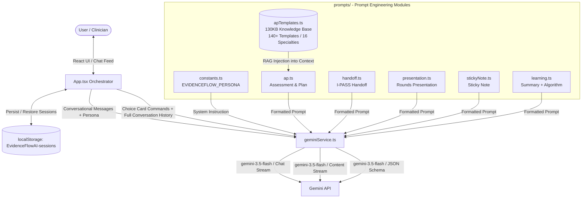

# EvidenceFlowAI: The Open-Source Clinical AI Operating System
## Project Documentation

**EvidenceFlowAI** is an open-source, persona-driven clinical AI copilot. Built on **Gemini (gemini-3.5-flash)** for blazing-fast inference, EvidenceFlowAI uses a sophisticated, multi-prompt architecture to shift between two operational runtimes: a **Configurable Mentorship Layer** that builds reasoning skills through guided questioning, and **Native System Utilities** that generate structured, evidence-based medical documentation on command. It is designed for hospitalists, residents, and medical educators who need a real-time thinking partner and documentation assistant at the bedside or during rounds.

---

## 🏗️ System Architecture & Data Flow

EvidenceFlowAI is a client-side single-page application (SPA) that communicates directly with Google's Gemini APIs. There is no backend server or database. All state is stored in the browser's `localStorage`.



---

## 🧠 The Two Operational Runtimes

### Runtime 1: Configurable Mentorship Layer (Socratic Preceptor)
Defined in [`constants.ts`](file:///Users/sku/drsku6/EvidenceFlowAI/constants.ts) via the `EVIDENCEFLOW_PERSONA` system instruction.

When a clinician enters a patient case, EvidenceFlowAI does **not** give a direct answer. Instead, it performs a silent **"Virtual Triage"** in the background to identify:
- **The Sickest Problem**: The most immediate life-threat.
- **"Can't Miss" Diagnoses**: The most dangerous possibilities requiring immediate rule-out.
- **Key Data Gaps**: Critical missing information (e.g., "What was the last troponin?").

Its first response is always a series of **Socratic, probing questions** categorized by organ system, pre-test probability, and safety priorities. The persona is engineered to reference major clinical trials by name (e.g., "the RALES trial"), apply validated risk scores (CURB-65, TIMI, GRACE), and anchor every recommendation to underlying **first-principles pathophysiology**.

This mode persists for the entire conversation, allowing the clinician to build a case iteratively through dialogue before triggering document generation.

---

### Runtime 2: Native System Utilities (Generative Document Commands)
On command (via the Choice Card UI or a slash command), the app assembles the full conversation history and passes it to a specialized prompt module in the `prompts/` directory. Each module shares a **unified Master Prompt** that declares the AI's role as "EvidenceFlow" — a clinical decision support tool and medical scribe — with strict core directives:

1. **Clinical Accuracy First**: The assessment/diagnosis must be grounded solely in the provided conversation context. No hallucination. For the plan, it applies current evidence-based guidelines.
2. **Structure and Clarity**: Outputs must use markdown (headings, bolding, lists) for scannable, EHR-ready formatting.
3. **Conciseness**: Eliminate redundant phrasing; include only clinically relevant details.
4. **Strict Format Adherence**: Each module enforces its own rigid output schema. No extra sections or commentary.

---

## 📂 Prompt Module Deep Dive (`prompts/`)

### 1. `ap.ts` — Assessment & Plan (with Mounted Data Layer)
**Triggered by**: `/assessment_and_plan` slash command or "Daily Progress Plan" choice card.

This is the most sophisticated prompt in the system. It bypasses blanket RAG setups, functioning as a true workspace OS **execution engine**.

**How it works:**
1. **Diagnose**: The model reads the conversation context and identifies the primary and secondary diagnoses.
2. **Retrieve**: The entire `apTemplates.ts` local data layer (130KB+, 140+ templates) is serialized and injected directly into the prompt context. The model is instructed to search this knowledge base for the template that best matches the patient's condition.
3. **Customize**: If a matching template is found, the model **mirrors its exact structure, headings, and bullet points** (e.g., `* Admit:`, `* Monitoring:`, `* Meds:`, `* Consults:`, `* Diagnostics:`), then fills in the patient's actual vitals, lab values, and history from the conversation.
4. **Generate**: If no template matches, it falls back to general medical knowledge to construct an evidence-based plan.

**Output structure enforced by the prompt:**
- `**Assessment & Plan**` with numbered acute issues, each containing a 1-2 sentence clinical justification followed by the plan.
- `**Chronic Conditions**` section (only if mentioned in the conversation).
- `**Disposition**` section with a detailed discharge plan and any barriers.

---

### 2. `handoff.ts` — I-PASS Written Handoff
**Triggered by**: `/handoff` slash command or "IPASS Handoff" choice card.

Generates a concise, written handoff structured in the **I-PASS format** — the evidence-based handoff protocol shown to reduce medical errors. The prompt instructs the model to generate content similar to a "sticky note" but in a structured handoff format.

**Output structure enforced by the prompt:**
- **Stability Level**: One of three triage categories — `Stable`, `Watcher`, or `Unstable`.
- **One-Liner**: A hyper-concise summary: age/sex, chief complaint, key vitals, and key labs/imaging.
- **Action List**: Each acute problem on its own line with its direct, specific management plan (medications with doses).
- **Contingency Plan**: A single "if/then" sentence covering the most critical watch-outs (e.g., "If hypotensive, give 500cc IVF bolus × 2").

---

### 3. `presentation.ts` — Oral Rounds Presentation
**Triggered by**: `/short_presentation` slash command or "Rounds Presentation" choice card.

Generates a structured, polished oral presentation formatted to be **read aloud during rounds**. The prompt strictly prohibits the model from adding any introductory or concluding remarks.

**Output structure enforced by the prompt:**
- **One-Liner**: Age, sex, relevant PMH, chief complaint, and duration of symptoms in a single sentence.
- **Subjective**: HPI in 1–3 sentences, focusing only on the most critical details.
- **Objective**: Bulleted list of Vitals → Exam (significant positives/negatives only) → Labs (critical abnormalities only) → Imaging summary.
- **Assessment & Plan**: Numbered list; each problem states the diagnosis followed by a brief, actionable plan for the day.

---

### 4. `stickyNote.ts` — Quick-Reference Sticky Note
**Triggered by**: `/sticky_note` slash command or "Quick Sticky Note" choice card.

Generates the most condensed output format — a **hyper-concise clinical dashboard card** for quick reference at the bedside. The prompt specifies the exact output structure with no deviation permitted.

**Output structure enforced by the prompt:**
- **Header line**: `age/sex with [Chief Complaint], [Key Vitals], [Key Labs]` — all on one line.
- **`Acute:`** section: Each acute problem on its own line with its specific management, including medication names and doses.
- **`Chronic:`** section: Each chronic condition with only the inpatient medication (no filler words like "continue").

---

### 5. `learning.ts` — Patient Summary & Master Board Algorithm
This file contains **two distinct prompt functions** serving different purposes.

#### 5a. `getPatientSummaryPrompt` — Structured JSON Session Summary
**Triggered**: Automatically in the background after each patient encounter to generate a session title and structured summary.

The model is instructed to output a **strict JSON object** (no markdown, no extra text) containing:
- `summary`: A comprehensive, organized clinical summary with standard headings (HPI, PMH, Medications, Vitals/Exam, Labs & Imaging, Assessment & Plan).
- `topic`: A single concise medical term representing the primary diagnosis (e.g., `"Acute Decompensated Heart Failure"`), used as the session title in the sidebar.

#### 5b. `getMasterAlgorithmPrompt` — Board-Style Clinical Algorithm
**Triggered by**: `/clinicalalgorithm [topic]` command.

Switches the AI into the role of an **Expert Medical Educator and ABIM Board Test Strategist**. The model generates a step-by-step thinking algorithm for board examination preparation.

The prompt enforces a **strict HTML output format** (not markdown) using Tailwind CSS class names for rendering directly inside the chat feed. The output structure is:
- **Steps** (e.g., "Step 1: What is the TYPE of dizziness?")
- **Diagnostic Buckets** (e.g., Vertigo → Peripheral vs. Central)
- **Classic Vignette Examples** for each condition, each containing:
  - `Vignette Keywords`: The classic exam presentation clues.
  - `Best Next Step`: An actionable clinical decision.

---

### 6. `apTemplates.ts` — Default Protocol Registry (Mounted Data Layer)
A 130KB+ structured local data layer containing **140+ evidence-based Assessment & Plan templates** organized across **16 medical specialty categories**:

| Specialty | Example Templates |
|---|---|
| **Cardiovascular** | Cardiac Arrest/Post-ROSC, Cardiogenic Shock, Aortic Dissection, ACS/STEMI/NSTEMI, Hypertensive Emergency, A-Fib with RVR, Syncope, ADHF (HFrEF/HFpEF) |
| **Pulmonary & Critical Care** | Septic Shock, ARDS, PE, COPD Exacerbation, Status Asthmaticus, CAP, Massive Hemoptysis, BiPAP/NIV |
| **Neurology** | Acute Ischemic Stroke, ICH/SAH, Elevated ICP, Bacterial Meningitis, Status Epilepticus, GBS/Myasthenia Crisis, Delirium/AMS, Spinal Cord Compression |
| **Gastroenterology & Hepatology** | Acute GI Bleed, Acute Pancreatitis, SBO, Hepatic Encephalopathy, SBP/HRS, Cholecystitis/Cholangitis, IBD Flare |
| **Nephrology & Electrolytes** | AKI, Hypo/Hypernatremia, Hypo/Hyperkalemia, Metabolic Acidosis |
| **Hematology & Oncology** | DVT/VTE, Neutropenic Fever, TTP/HUS, Sickle Cell Crisis |
| **Infectious Disease** | Sepsis, HAP/VAP, HIV/AIDS complications, SSTI, Endocarditis |
| **Endocrinology** | DKA, HHS, Adrenal Insufficiency, Thyroid Storm, Hypoglycemia |
| **Rheumatology** | Gout/Pseudogout flare, Lupus flare, Vasculitis |
| **Psychiatry & Substance Use** | Alcohol Withdrawal/CIWA, Opioid Withdrawal, Acute Psychosis |
| **Geriatrics, Rehab & DME** | Falls, Frailty assessment, Pressure ulcers, DME planning |
| **Goals of Care & Counseling** | DNR/DNI discussions, Comfort care, Hospice transition |
| **Pharmacology Pearls** | High-risk drug interactions, Dosing in renal/hepatic failure |
| **Exam & Note Blocks** | Standard physical exam templates, SOAP note components |
| **Admin & Legal** | AMA documentation, Capacity assessment, Incident reporting |
| **Other Specialties** | Dermatology, Ophthalmology, ENT, Orthopedics consult notes |

Each template contains a structured plan with standardized headings (`Admit`, `Monitoring`, `Meds`, `Breathing Treatment`, `Consults`, `Diagnostics`) populated with specific medication names, doses, thresholds, and referenced clinical trials, making them directly customizable to the patient's live data.

---

### 7. `/ask_the_expert` and `/run_simulation` — Runtime 1 Commands (No Prompt Module)
**Triggered by**: Typing `/ask_the_expert [question]` or `/run_simulation [scenario]` directly.

These two commands have no dedicated prompt module in `prompts/`. They are handled entirely by **Runtime 1** — the persistent `ai.chats.create()` session initialized with the `EVIDENCEFLOW_PERSONA` system instruction.

- **`/ask_the_expert`**: The question is sent directly to `chat.sendMessageStream()`. The Socratic Preceptor persona handles it natively — answering with the "unwritten rules" framing, clinical trial references, and first-principles reasoning baked into the system instruction.
- **`/run_simulation`**: The scenario prompt is sent directly to `chat.sendMessageStream()`. The persona shifts into simulation mode, presenting a dynamic clinical emergency and responding to the user's real-time decisions within the same conversation thread.

Both commands intentionally bypass the one-shot generation pipeline to preserve the interactive, multi-turn conversation context.

---

## 🛠️ Technology Stack

| Layer | Technology |
|---|---|
| **Frontend Framework** | [React 19](https://react.dev) — Functional components, hooks (`useState`, `useRef`, `useEffect`, `useCallback`), and refs |
| **Build System** | [Vite 6](https://vite.dev) — ESM-based fast bundler; exposes `VITE_GEMINI_API_KEY` to client bundle |
| **Styling** | [Tailwind CSS](https://tailwindcss.com) — Custom theme palette loaded via CDN; defined in `index.html` |
| **Language** | [TypeScript 5](https://www.typescriptlang.org) — Strict types for `Message`, `Session`, `ChatSession`, and API payloads |
| **LLM Integration** | [@google/genai v1.25.0](https://www.npmjs.com/package/@google/genai) — `GoogleGenAI` class, streaming via `generateContentStream` and `chat.sendMessageStream` |
| **Markdown Rendering** | `react-markdown` + `remark-gfm` — Renders clinical guidelines, tables, and lists cleanly in chat bubbles |

---

## 📁 Project Directory Structure

```
EvidenceFlowAI/
├── components/
│   ├── Feedback.tsx        # Floating feedback modal with rating and comment capture
│   └── icons.tsx           # SVG icon library used throughout the UI
├── prompts/                # All prompt engineering modules (see deep-dive above)
│   ├── ap.ts               # A&P generator with RAG instruction and output schema
│   ├── apTemplates.ts      # 130KB local knowledge base: 140+ templates, 16 specialties
│   ├── handoff.ts          # I-PASS written handoff prompt and output schema
│   ├── learning.ts         # JSON patient summary + HTML master algorithm prompts
│   ├── presentation.ts     # Oral rounds presentation prompt and output schema
│   └── stickyNote.ts       # Hyper-concise sticky note prompt and output schema
├── services/
│   └── geminiService.ts    # Gemini API client: chat session init, streaming, JSON schema output
├── App.tsx                 # Main orchestrator: state, routing, UI layout, session management
├── constants.ts            # EVIDENCEFLOW_PERSONA system instruction + COMMANDS list
├── index.html              # HTML entrypoint, Tailwind CDN config, and module mount
├── index.tsx               # React root renderer
├── types.ts                # TypeScript interfaces: Message, Session, ChatSession, Sender
├── tsconfig.json           # TypeScript compiler config (esModuleInterop, strict mode)
├── package.json            # Dependencies, scripts, and project metadata
└── vite.config.ts          # Vite config: API key injection and build settings
```

---

## 🧩 Component & Service Breakdown

### 1. Main Application Orchestrator ([`App.tsx`](file:///Users/sku/drsku6/EvidenceFlowAI/App.tsx))

The central state machine. Key responsibilities:

- **Session Management**: Creates sessions using `crypto.randomUUID()`, persists them to `localStorage` under `EvidenceFlowAI-sessions`, and restores them on reload. Implements auto-recovery: if an active session ID is lost (e.g., after a cache clear), the app automatically falls back to the first available session or creates a new one.
- **Choice Card Interception**: When the first user message in a session does not begin with a slash command, `App.tsx` intercepts it before sending to the AI. Instead of triggering a Gemini API call, it renders an interactive **Choice Card** directly in the chat feed. The card presents 7 options — 5 Native System Utility commands (Runtime 2), plus Socratic Mentorship and Clinical Simulation (both Runtime 1). Only after the user selects a mode does the app route the original patient description to the appropriate runtime. This design separates intent declaration from AI response — the system never guesses what the clinician needs from a patient description.
- **Message Router**: After mode selection, routes subsequent messages either to the Socratic chat stream or to the appropriate prompt module for document generation.
- **Sidebar Resize**: Custom mouse drag logic allows the sidebar to be resized between 200px and 500px.
- **Copy-to-Clipboard**: Every AI response has a one-click copy action for fast pasting into EHR systems.

### 2. Service Layer ([`services/geminiService.ts`](file:///Users/sku/drsku6/EvidenceFlowAI/services/geminiService.ts))

Handles all Gemini API communication:

- **`createChatSession(history)`**: Initializes a persistent `ai.chats.create()` session with the `EVIDENCEFLOW_PERSONA` as the system instruction and the existing conversation history pre-loaded.
- **`sendMessageStream(chat, message, conversationHistory)`**: The message router. Internally calls `getPromptForCommand()` to determine if the message is a slash command. If yes, assembles the full conversation history string, builds the specialized prompt, and calls `ai.models.generateContentStream()` for one-shot document generation. If no, forwards the message directly to `chat.sendMessageStream()` for the persistent Socratic conversation.
- **`generateMasterAlgorithm(input)`**: Calls `ai.models.generateContent()` to produce a board-style HTML algorithm from a topic string or patient case. Used by the `/clinicalalgorithm` command as a standalone generation call.
- **`generatePatientSummary(history)`**: Calls `ai.models.generateContent()` with `responseMimeType: 'application/json'` and a strict JSON schema to force structured output for session titling and summary generation.

### 3. Prompt Architecture Summary

| File / Command | Runtime | Output Format | Special Mechanism |
|---|---|---|---|
| `constants.ts` | Runtime 1 — Socratic Preceptor | Conversational markdown | `EVIDENCEFLOW_PERSONA` system instruction · Virtual Triage |
| `/ask_the_expert` | Runtime 1 — Socratic Preceptor | Conversational markdown | No prompt module — handled by chat session with persona |
| `/run_simulation` | Runtime 1 — Socratic Preceptor | Conversational markdown | No prompt module — handled by chat session with persona |
| `ap.ts` | Runtime 2 — Native System Utility | Structured markdown (A&P) | 130KB data layer injection · Diagnose → Match → Customize |
| `handoff.ts` | Runtime 2 — Native System Utility | I-PASS markdown | Stability triage + contingency logic |
| `presentation.ts` | Runtime 2 — Native System Utility | Oral-ready markdown | One-liner → SOAP format |
| `stickyNote.ts` | Runtime 2 — Native System Utility | Ultra-concise markdown | Fixed schema, no filler words |
| `learning.ts` (summary) | Background — auto | Strict JSON | `responseMimeType: application/json` + response schema |
| `learning.ts` (algorithm) | Runtime 2 — Native System Utility | Raw HTML + Tailwind | Step/bucket/vignette structure for ABIM board prep |

---

## 🔒 Security & Safe Deployment

### API Key Management
- **Never commit `.env.local`**. The `.gitignore` is pre-configured to exclude all `.env*` files.
- During development, create `.env.local` in the project root:
  ```env
  GEMINI_API_KEY=your_actual_api_key_here
  ```
- Vite reads this at build time and injects it into the client bundle via `import.meta.env.VITE_GEMINI_API_KEY`.

### Clinical Data Privacy (HIPAA)
> **⚠️ CRITICAL: DO NOT ENTER REAL PATIENT DATA (PHI/PII).**

- **Client-Side Only**: All chat logs and session data live exclusively in the browser's `localStorage`. No data is ever written to an external database.
- **API Transmission**: User inputs are transmitted to Google's Gemini API endpoints. For institutional deployment, ensure your Google Cloud project is covered by a **Business Associate Agreement (BAA)** to prevent inputs from being used in public model training.
- **Use De-identified Cases**: Always use fictional or fully de-identified patient cases when demoing, teaching, or testing.

---

## 🚀 Installation & Local Development

### 1. Clone & Setup
```bash
git clone git@github.com:drsku6/EvidenceFlowAI.git
cd EvidenceFlowAI
npm install
```

### 2. Environment Configuration
```bash
touch .env.local
```
Add your Gemini API key:
```env
GEMINI_API_KEY=AIzaSy...
```

### 3. Start Development Server
```bash
npm run dev
```
The app launches at `http://localhost:3000`.

### 4. Build for Production
```bash
npm run build
```
Compiles and minifies to `dist/` for deployment on any static host (Firebase Hosting, Google Cloud Storage, Netlify, etc.).
